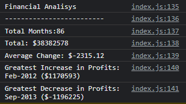

# Console-Finances
Solve a problem using JavaScript fundamentals.

## Description
In this project a real problem needed to be solved. Using JavaScript fundamentals, a code for analyzing the financial records of a company, should have been created. It contained starter code - simple HTML file and external JS file linked in index.html. To complete this assignment you have to think as a developer to implement your thoughts into code. And beside of that you'll need to be familiar with basics of JavaScript like variables, loops, conditionals, operators.

## Instalation
N/A

### Usage
In this project JS file, named index.js, already contained a code. It was a 2DArray. To follow acceptance criteria the next steps were done:

* the length of an array was defined - the total number of months;
* veriables, used in cose, were defined and given a value;
* the net total amount of Profit/Losses over the entire period using for loop and if conditionals;
* the greatest Profits/Losses over the period through the same for loop and if conditionals;
* the average change from month to month and and total average itself.

After all calculations console messages look like that:

### Credits
N/A

### License
Please refer to the LICENSE in the repo.